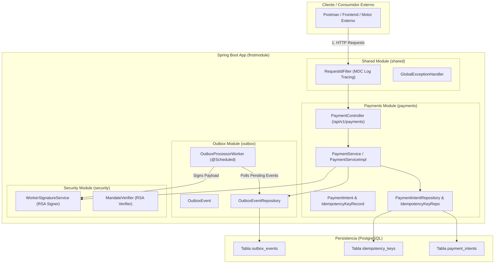
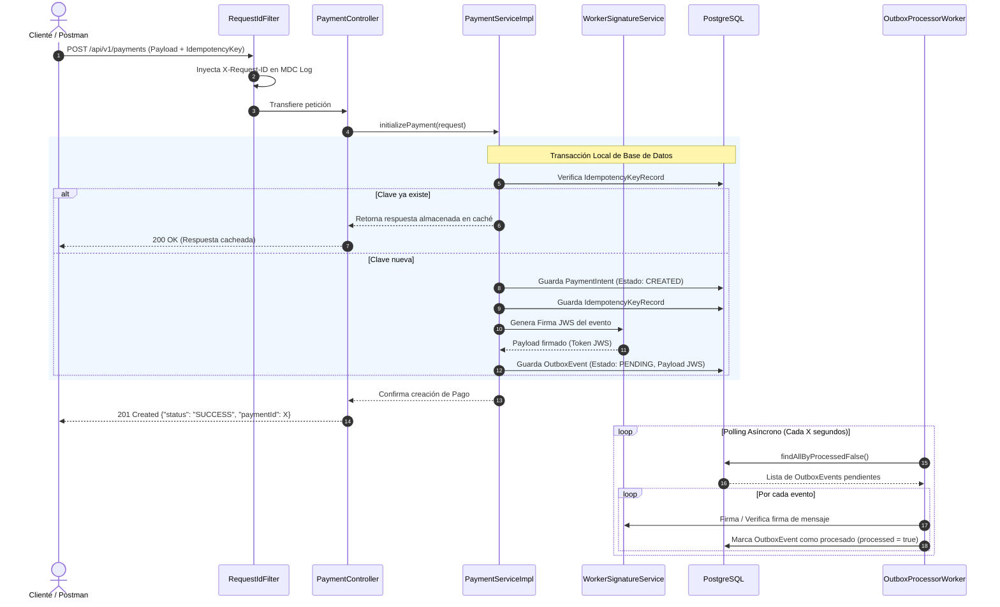

# B2B Micro-Payment Transaction Engine


Un motor de procesamiento de micro-pagos diseñado para entornos B2B de alta exigencia. Esta API RESTful orquesta transacciones financieras garantizando consistencia absoluta de datos, control de duplicidad mediante llaves de idempotencia y validación estricta de estados.

El diseño arquitectónico está basado en **Monolito Modular con Patrones Distribuidos**, preparado para integrarse con pasarelas tradicionales o servir como capa de infraestructura para automatización financiera y liquidaciones con *stablecoins*.

---

## 🏗️ Arquitectura y Patrones Core

* **Monolito Modular:** El sistema está estructurado en módulos/dominios independientes (`payments`, `outbox`, `security`, `shared`) conviviendo dentro del mismo ejecutable Spring Boot. Mantiene fronteras claras de dominio con la facilidad de un despliegue único.
* **Transactional Outbox Pattern (`outbox`):** Garantiza la entrega de eventos sin recurrir a transacciones distribuidas 2PC. Los eventos se persisten en la tabla `outbox_events` dentro de la misma transacción del pago y son procesados asíncronamente por `OutboxProcessorWorker`.
* **Firma Criptográfica JWS (`security`):** Firma asimétrica de eventos con par de claves RSA (Nimbus JOSE). Esto asegura la integridad y autenticidad del mensaje como si se transmitiera hacia sistemas externos o microservicios.
* **Idempotency Engine:** Escudo de base de datos que intercepta peticiones de red duplicadas o reintentos fallidos, cacheando el código HTTP y el payload original en formato `jsonb` para evitar dobles cobros.
* **Finite State Machine (FSM):** Modelo de dominio rico encapsulado. Las transacciones de los pagos (ej. `CREATED` -> `AUTHORIZED` -> `CONFIRMED`) están gobernadas por reglas inmutables que rechazan saltos de estado ilegales.
* **ACID Transactions & Optimistic Locking:** Uso estricto de orquestación `@Transactional` y versionado `@Version` de Hibernate para consistencia atómica.
* **Global Exception Handling:** Interceptor global (`@RestControllerAdvice`) que atrapa excepciones de negocio (pagos no encontrados, transacciones ilegales) y las transforma en respuestas JSON estandarizadas.

---

## 📐 Estructura del Monolito Modular

### ¿Es un sistema distribuido?
> **No es un sistema 100% distribuido**, es un **Monolito Modular que implementa Patrones Distribuidos**. Corre en un solo proceso Java/Spring Boot con una base de datos PostgreSQL compartida, pero utiliza patrones como **Transactional Outbox**, **Idempotencia** y **Firma JWS** para garantizar desacoplamiento y consistencia eventual como en arquitecturas distribuidas.

### Organización de Paquetes por Dominio

```text
src/main/java/com/vk42/cbp/firstmodule/
├── payments/              # Módulo de Pagos
│   ├── api/               # PaymentController, DTOs (Request/Response, Webhooks)
│   ├── domain/            # Entities (PaymentIntent, IdempotencyKeyRecord), Enums, Repositories
│   └── service/           # PaymentService, PaymentServiceImpl
├── outbox/                # Módulo Transactional Outbox
│   ├── domain/            # OutboxEvent, OutboxEventRepository
│   └── worker/            # OutboxProcessorWorker (@Scheduled)
├── security/              # Módulo de Seguridad y Criptografía
│   ├── jws/               # WorkerSignatureService (Firma JWS RSA)
│   └── verification/      # MandateVerifier
└── shared/                # Componentes Transversales Compartidos
    ├── dto/               # ErrorResponse
    ├── exceptions/        # GlobalExceptionHandler, Excepciones de Dominio
    └── filters/           # RequestIdFilter (MDC Log Tracing)
```

---

## 📊 Diagramas de Arquitectura

### 1. Diagrama de Componentes (Monolito Modular)



---

### 2. Flujo de Secuencia (Transactional Outbox & Idempotencia)



---

## 🚀 Instalación y Despliegue

### Prerrequisitos
* Java JDK 21 o superior.
* PostgreSQL corriendo en el puerto `5432`.
* Maven Wrapper (`./mvnw`).

### Configuración
Configura tus credenciales de base de datos en el archivo `firstmodule/src/main/resources/application.properties`:

```properties
spring.datasource.url=jdbc:postgresql://localhost:5432/firstmodule
spring.datasource.username=postgres
spring.datasource.password=postgres
spring.jpa.hibernate.ddl-auto=update
```

### Ejecución

Compila y levanta la aplicación:

```bash
cd firstmodule
./mvnw spring-boot:run
```

El servidor estará escuchando por defecto en `http://localhost:8080`.

---

## 🔌 API Endpoints & Flujo de Uso

### 1. Inicializar un Pago (Sembrar)
Crea una nueva intención de pago en estado `CREATED`.

* **POST** `/api/v1/payments`
* **Headers:** `Content-Type: application/json`, `X-Request-ID: req-001` *(opcional)*

```json
{
  "amount": 1500.50,
  "currency": "USD",
  "idempotencyKey": "init-key-001"
}
```

**Respuesta (201 Created):**
```json
{
  "status": "SUCCESS",
  "paymentId": 1
}
```

---

### 2. Orquestar Estado (Webhook)
Simula la respuesta de una pasarela o motor externo para avanzar el estado del pago. Si envías la misma `idempotencyKey` dos veces, el motor devolverá la respuesta cacheada.

* **POST** `/api/v1/payments/webhooks`

```json
{
  "paymentId": 1,
  "newState": "AUTHORIZED",
  "idempotencyKey": "webhook-auth-key-001"
}
```

**Respuesta (200 OK):**
```json
{
  "status": "SUCCESS",
  "paymentId": 1
}
```

---

### 3. Consultar Estado de Pago
Obtén el estado inmutable actual del pago.

* **GET** `/api/v1/payments/{paymentId}`

**Respuesta (200 OK):**
```json
"AUTHORIZED"
```

---

### 4. Probar Firma JWS Worker
Verifica el servicio de firma criptográfica JWS.

* **GET** `/api/v1/payments/test-signature`

**Respuesta (200 OK):**
```text
eyJhbGciOiJSUzI1NiJ9.eyJwYXltZW50X2lkIjogIjEyMyIsICJzdGF0dXMiOiAiQ09ORklSTUVEIn0...
```
