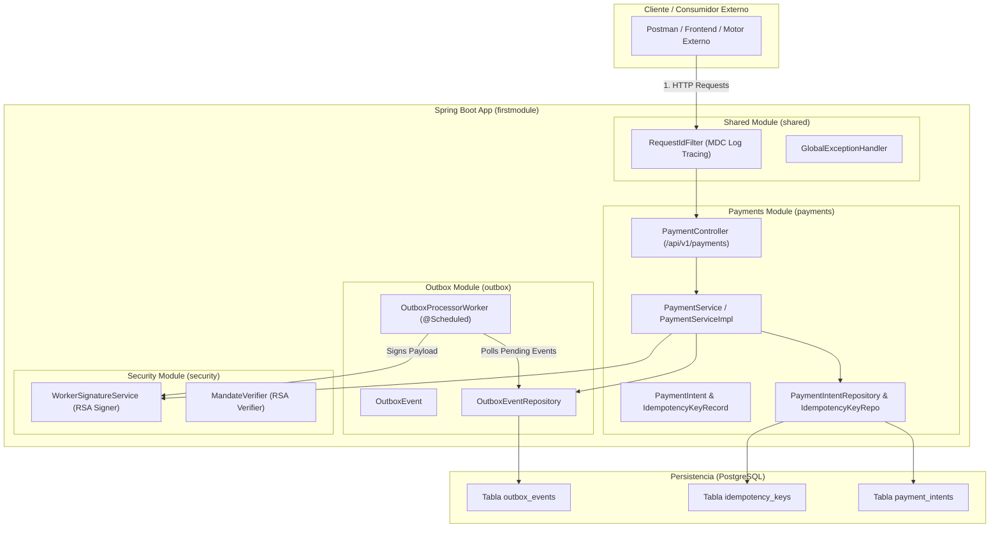
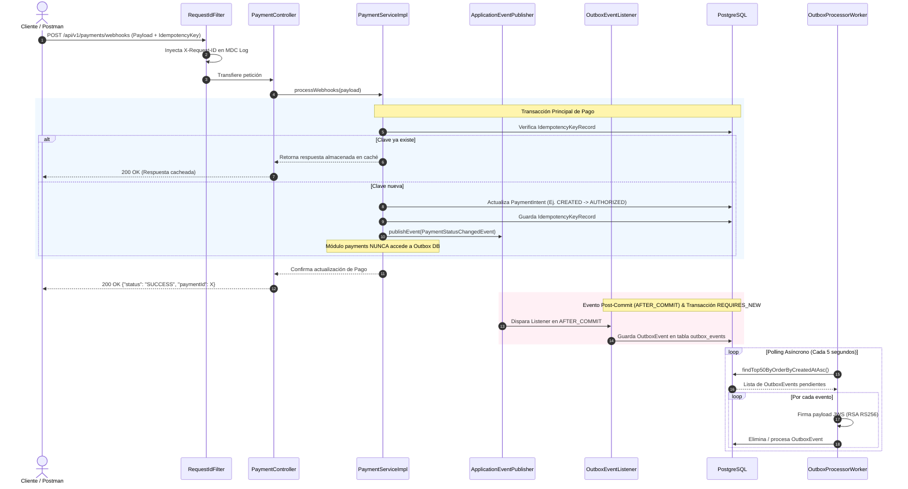

# B2B Micro-Payment Transaction Engine


Un motor de procesamiento de micro-pagos diseñado para entornos B2B de alta exigencia. Esta API RESTful orquesta transacciones financieras garantizando consistencia absoluta de datos, control de duplicidad mediante llaves de idempotencia y validación estricta de estados.

El diseño arquitectónico está basado en **Monolito Modular con Patrones Distribuidos**, preparado para integrarse con pasarelas tradicionales o servir como capa de infraestructura para automatización financiera y liquidaciones con *stablecoins*.

---

## 📌 Estado del Roadmap (Master Plan)

- [x] **Fase 0: Consolidación y Verificación de Fundamentos Core** (FSM `canTransitionTo`, Idempotencia JSONB con Jackson 3, Firma JWS RSA, Tracing MDC y Pruebas WebMvcTest).
- [x] **Fase 1: Event-Driven In-Process Decoupling** (Desacoplamiento total intra-proceso usando `ApplicationEventPublisher` y `@TransactionalEventListener`).
- [ ] **Fase 2: Resiliencia en Outbox Worker** (Exponential Backoff + Dead Letter Queue - DLQ).
- [ ] **Fase 3: Guardián de Fronteras Modulares** (Spring Modulith & ArchUnit).
- [ ] **Fase 4: Reconciliación Automática y Autocuración** (`reconciliation` worker).
- [ ] **Fase 5: Observabilidad Extendida & Rate Limiting Multi-tenant** (Bucket4j).

---

## 🏗️ Arquitectura y Patrones Core

* **Monolito Modular:** El sistema está estructurado en módulos/dominios independientes (`payments`, `outbox`, `security`, `shared`) conviviendo dentro del mismo ejecutable Spring Boot. Mantiene fronteras claras de dominio con la facilidad de un despliegue único.
* **Event-Driven In-Process Decoupling (`payments` $\rightarrow$ `outbox`):** El módulo de pagos publica eventos de dominio `PaymentStatusChangedEvent` a través de `ApplicationEventPublisher`. El módulo de pagos **ya no conoce las entidades ni repositorios de Outbox**.
* **Transactional Outbox Pattern con Listeners (`outbox`):** `@TransactionalEventListener(phase = TransactionPhase.AFTER_COMMIT)` captura los eventos del pago solo cuando la transacción original hace `COMMIT`. Utiliza `@Transactional(propagation = Propagation.REQUIRES_NEW)` para persistir el `OutboxEvent` en una transacción aislada de forma 100% segura.
* **Firma Criptográfica JWS (`security`):** Firma asimétrica de eventos con par de claves RSA (Nimbus JOSE). Esto asegura la integridad y autenticidad del mensaje como si se transmitiera hacia sistemas externos o microservicios.
* **Engine de Idempotencia:** Escudo de base de datos que intercepta peticiones de red duplicadas o reintentos fallidos, cacheando el código HTTP y el payload original en formato `jsonb` de PostgreSQL para evitar dobles cobros.
* **Finite State Machine (FSM):** Modelo de dominio rico encapsulado. Las transacciones de los pagos (`CREATED` -> `AUTHORIZED` -> `SUBMITTED` -> `CONFIRMED` / `FAILED` -> `RECONCILED`) están gobernadas por el método `canTransitionTo` que rechaza saltos de estado ilegales.
* **ACID Transactions & Optimistic Locking:** Uso estricto de orquestación `@Transactional` y versionado `@Version` de Hibernate para consistencia atómica.
* **Global Exception Handling & MDC Tracing:** Interceptor global (`@RestControllerAdvice`) que atrapa excepciones de negocio transformándolas en `ErrorResponse` DTOs, junto con `RequestIdFilter` que inyecta `X-Request-ID` al MDC de logs.

---

## 📐 Estructura del Monolito Modular

### Organización de Paquetes por Dominio

```text
src/main/java/com/vk42/cbp/firstmodule/
├── payments/              # Módulo de Pagos (Core Engine)
│   ├── api/               # PaymentController, DTOs (Request/Response, Webhooks)
│   ├── domain/            # Entities (PaymentIntent, IdempotencyKeyRecord), Enums (PaymentState)
│   ├── events/            # PaymentStatusChangedEvent (Evento de Dominio Inmutable)
│   └── service/           # PaymentService, PaymentServiceImpl (Publica eventos de dominio)
├── outbox/                # Módulo Transactional Outbox (Desacoplado)
│   ├── domain/            # OutboxEvent, OutboxEventRepository
│   ├── listener/          # OutboxEventListener (@TransactionalEventListener AFTER_COMMIT)
│   └── worker/            # OutboxProcessorWorker (@Scheduled)
├── security/              # Módulo de Seguridad y Criptografía
│   ├── jws/               # WorkerSignatureService (Firma JWS RSA)
│   └── verification/      # MandateVerifier
└── shared/                # Componentes Transversales Compartidos
    ├── dto/               # ErrorResponse
    ├── exceptions/        # GlobalExceptionHandler, Excepciones de Dominio
    └── filters/           # RequestIdFilter (MDC Log Tracing)
```

---

## 📊 Diagramas de Arquitectura

### 1. Diagrama de Componentes (Monolito Modular)



---

### 2. Flujo de Secuencia (Desacoplado por Eventos & Transactional Outbox)



---

## 🚀 Instalación y Despliegue

### Prerrequisitos
* Java JDK 21 o superior.
* PostgreSQL corriendo en el puerto `5432`.
* Maven Wrapper (`./mvnw`).

### Configuración
Configura tus credenciales de base de datos en el archivo `firstmodule/src/main/resources/application.properties`:

```properties
spring.datasource.url=jdbc:postgresql://localhost:5432/firstmodule
spring.datasource.username=postgres
spring.datasource.password=postgres
spring.jpa.hibernate.ddl-auto=update
```

### Ejecución

Compila y levanta la aplicación:

```bash
cd firstmodule
./mvnw spring-boot:run
```

El servidor estará escuchando por defecto en `http://localhost:8080`.

---

## 🔌 API Endpoints & Flujo de Uso

### 1. Inicializar un Pago (Sembrar)
Crea una nueva intención de pago en estado `CREATED`.

* **POST** `/api/v1/payments`
* **Headers:** `Content-Type: application/json`, `X-Request-ID: req-001` *(opcional)*

```json
{
  "amount": 1500.50,
  "currency": "USD",
  "idempotencyKey": "init-key-001"
}
```

**Respuesta (201 Created):**
```json
{
  "status": "SUCCESS",
  "paymentId": 1
}
```

---

### 2. Orquestar Estado (Webhook)
Simula la respuesta de una pasarela o motor externo para avanzar el estado del pago. Si envías la misma `idempotencyKey` dos veces, el motor devolverá la respuesta cacheada.

* **POST** `/api/v1/payments/webhooks`

```json
{
  "paymentId": 1,
  "newState": "AUTHORIZED",
  "idempotencyKey": "webhook-auth-key-001"
}
```

**Respuesta (200 OK):**
```json
{
  "status": "SUCCESS",
  "paymentId": 1
}
```

---

### 3. Consultar Estado de Pago
Obtén el estado inmutable actual del pago.

* **GET** `/api/v1/payments/{paymentId}`

**Respuesta (200 OK):**
```json
"AUTHORIZED"
```

---

### 4. Probar Firma JWS Worker
Verifica el servicio de firma criptográfica JWS.

* **GET** `/api/v1/payments/test-signature`

**Respuesta (200 OK):**
```text
eyJhbGciOiJSUzI1NiJ9.eyJwYXltZW50X2lkIjogIjEyMyIsICJzdGF0dXMiOiAiQ09ORklSTUVEIn0...
```
