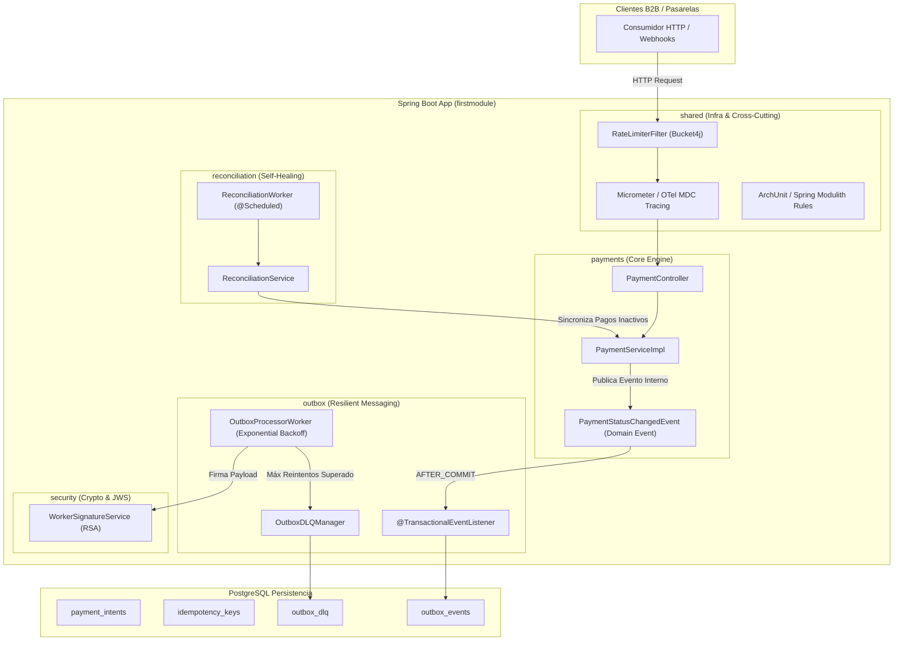

# 🚀 Master Plan: Elevando el Monolito Modular de Micro-Pagos B2B al Siguiente Nivel

> **Para Desarrolladores / Agentes AI:**  
> **Sub-Skill Requerido:** Usar `superpowers:subagent-driven-development` o `superpowers:executing-plans` para ejecutar este plan fase por fase. Las tareas utilizan sintaxis de lista de verificación (`- [ ]`).

---

## 📌 Contexto y Estado Actual
El sistema actual **B2B Micro-Payment Transaction Engine** es un **Monolito Modular** en Java 21 / Spring Boot 3 con PostgreSQL.  
Posee una arquitectura sólida dividida en 4 dominios principales:
1. `payments`: Control de ciclo de vida con FSM (`CREATED` -> `AUTHORIZED` -> `CONFIRMED`), Idempotencia mediante DB lock/cache y controladores REST.
2. `outbox`: Implementación de *Transactional Outbox Pattern* con `OutboxEvent` y worker programado (`OutboxProcessorWorker`).
3. `security`: Firma asimétrica criptográfica de payloads (JWS con RSA Nimbus JOSE).
4. `shared`: Manejo global de excepciones (`GlobalExceptionHandler`), tracing básico con `RequestIdFilter` (MDC).

---

## 🎯 Objetivo del Master Plan
Transformar el motor de micro-pagos en un **Monolito Modular Enterprise Ready de Grado de Producción**, garantizando:
- Desacoplamiento total intra-proceso guiado por eventos de dominio.
- Resiliencia ante fallos extremos en la capa de mensajería (Dead Letter Queue + Exponential Backoff).
- Verificación automatizada de fronteras de encapsulación arquitectónica.
- Autocuración y reconciliación de transacciones financieras colgadas.
- Observabilidad distribuida y protección contra saturación (Rate Limiting multi-tenant).

---

## 📐 Arquitectura Objetivo (Target State)



---

## 🗺️ Desglose por Fases (Master Roadmap)

---

### 🔹 Fase 0: Consolidación y Verificación de los Fundamentos Core (Puntos de Fortaleza)
**Meta:** Validar, pulir y estabilizar los pilares base ya existentes del motor de pagos (FSM, Idempotencia, Outbox básico, JWS/RSA, Tracing MDC y Excepciones) antes de proceder al desacoplamiento guiado por eventos y resiliencia avanzada.

#### Archivos involucrados:
- **Modificar:** `firstmodule/src/main/java/com/vk42/cbp/firstmodule/payments/domain/PaymentState.java` (Renombrar `canTransactionTo` a `canTransitionTo`)
- **Modificar:** `firstmodule/src/main/java/com/vk42/cbp/firstmodule/payments/service/PaymentServiceImpl.java` (Corregir importación de Jackson a `com.fasterxml.jackson.databind.ObjectMapper` y actualizar llamadas a `canTransitionTo`)
- **Verificar/Refactorizar:** `firstmodule/src/main/java/com/vk42/cbp/firstmodule/security/jws/WorkerSignatureService.java` y `MandateVerifier.java` (Carga segura y tolerante de llaves RSA)
- **Verificar:** `firstmodule/src/main/java/com/vk42/cbp/firstmodule/shared/filters/RequestIdFilter.java` y `GlobalExceptionHandler.java`
- **Crear/Test:** `firstmodule/src/test/java/com/vk42/cbp/firstmodule/payments/PaymentCoreStateAndIdempotencyTest.java`

#### Requisitos de Implementación:
1. **Máquina de Estados de Pago (`PaymentState`)**:
   - Corregir la nomenclatura del método a `canTransitionTo(PaymentState nextState)`.
   - Garantizar que las transiciones de estado (`CREATED` -> `AUTHORIZED` -> `SUBMITTED` -> `CONFIRMED` / `FAILED` -> `RECONCILED`) estén 100% probadas unitariamente.
2. **Idempotencia y Persistencia JSONB**:
   - Asegurar que la serialización de respuestas en `IdempotencyKeyRecord` utilice la librería estándar `com.fasterxml.jackson.databind.ObjectMapper`.
   - Validar que ante peticiones duplicadas con la misma `idempotencyKey`, se retorne la respuesta cacheada sin re-ejecutar lógica de negocio.
3. **Firma Criptográfica Asimétrica (JWS / RSA)**:
   - Validar la firma RS256 mediante Nimbus JOSE en `WorkerSignatureService` y su posterior verificación en `MandateVerifier`.
   - Garantizar resiliencia al arrancar si las llaves no han sido provistas en entornos de desarrollo/local.
4. **Manejo Global de Excepciones y Trazabilidad (MDC)**:
   - Confirmar que `GlobalExceptionHandler` retorne DTOs `ErrorResponse` estandarizados (`PAYMENT_NOT_FOUND`, `INVALID_STATE_TRANSITION`, `VALIDATION_FAILED`).
   - Verificar que `RequestIdFilter` inyecte correctamente `X-Request-ID` en el MDC de SLF4J y en las respuestas HTTP.

---

### 🔹 Fase 1: Event-Driven In-Process Decoupling
**Meta:** Reemplazar llamadas directas o acopladas entre `payments` y `outbox` mediante `Spring ApplicationEventPublisher` y `@TransactionalEventListener`.

#### Archivos involucrados:
- **Crear:** `firstmodule/src/main/java/com/vk42/cbp/firstmodule/payments/domain/events/PaymentStatusChangedEvent.java`
- **Crear:** `firstmodule/src/main/java/com/vk42/cbp/firstmodule/outbox/listener/OutboxEventListener.java`
- **Modificar:** `firstmodule/src/main/java/com/vk42/cbp/firstmodule/payments/service/PaymentServiceImpl.java`
- **Test:** `firstmodule/src/test/java/com/vk42/cbp/firstmodule/payments/PaymentEventPublisherTest.java`

#### Requisitos de Implementación:
1. Crear el record inmutable `PaymentStatusChangedEvent(Long paymentId, PaymentStatus previousState, PaymentStatus newState, String idempotencyKey)`.
2. Inyectar `ApplicationEventPublisher` en `PaymentServiceImpl` y publicar el evento al cambiar de estado.
3. Crear `OutboxEventListener` anotado con `@TransactionalEventListener(phase = TransactionPhase.AFTER_COMMIT)`.
4. Al recibir el evento, insertar automáticamente el `OutboxEvent` en estado `PENDING` dentro de su propia transacción aislada (`@Transactional(propagation = Propagation.REQUIRES_NEW)`).

---

### 🔹 Fase 2: Resiliencia en Outbox Worker (Retry Exponential Backoff + Dead Letter Queue - DLQ)
**Meta:** Evitar la saturación del worker por eventos fallidos persistentes y capturar fallas fatales en una tabla DLQ.

#### Archivos involucrados:
- **Crear:** `firstmodule/src/main/java/com/vk42/cbp/firstmodule/outbox/domain/OutboxDLQ.java`
- **Crear:** `firstmodule/src/main/java/com/vk42/cbp/firstmodule/outbox/domain/OutboxDLQRepository.java`
- **Modificar:** `firstmodule/src/main/java/com/vk42/cbp/firstmodule/outbox/domain/OutboxEvent.java` (agregar `retryCount`, `maxRetries`, `lastError`, `nextRetryAt`)
- **Modificar:** `firstmodule/src/main/java/com/vk42/cbp/firstmodule/outbox/worker/OutboxProcessorWorker.java`
- **Crear:** `firstmodule/src/main/java/com/vk42/cbp/firstmodule/outbox/api/OutboxAdminController.java` (Endpoints para consultar y re-intentar DLQ)
- **Test:** `firstmodule/src/test/java/com/vk42/cbp/firstmodule/outbox/OutboxRetryDLQTest.java`

#### Requisitos de Implementación:
1. Extender `OutboxEvent` con campos de reintento:
   - `retryCount` (default: 0)
   - `maxRetries` (default: 5)
   - `lastError` (text)
   - `nextRetryAt` (Instant)
2. Modificar la query de polling del worker: `findEligiblePendingEvents(Instant now)` donde `processed = false AND (nextRetryAt IS NULL OR nextRetryAt <= now) AND retryCount < maxRetries`.
3. Si la entrega o procesamiento falla:
   - Incrementar `retryCount`.
   - Calcular backoff exponencial: $2^{\text{retryCount}} \times 5 \text{ segundos}$.
   - Actualizar `nextRetryAt` y `lastError`.
   - Si `retryCount >= maxRetries`, mover el registro a `outbox_dlq` y marcar el evento original como `FAILED_PERMANENT`.
4. Exponer endpoints administrativos:
   - `GET /api/v1/admin/outbox/dlq`: Lista eventos fallidos en DLQ.
   - `POST /api/v1/admin/outbox/dlq/{id}/retry`: Mueve de nuevo de DLQ a PENDING para reintento manual.

---

### 🔹 Fase 3: Guardián de Fronteras Modulares (Spring Modulith & ArchUnit)
**Meta:** Validar en tiempo de compilación y pruebas unitarias que la arquitectura del Monolito Modular respete estrictamente los límites entre paquetes.

#### Archivos involucrados:
- **Modificar:** `firstmodule/pom.xml` (Agregar dependencias de `spring-modulith-starter-test` y `archunit-junit5`)
- **Crear:** `firstmodule/src/test/java/com/vk42/cbp/firstmodule/architecture/ModularArchitectureTest.java`
- **Crear:** `firstmodule/src/main/java/package-info.java` o anotaciones `@ApplicationModule` en sub-paquetes.

#### Requisitos de Implementación:
1. Añadir dependencias en `pom.xml`:
   ```xml
   <dependency>
       <groupId>org.springframework.modulith</groupId>
       <artifactId>spring-modulith-starter-test</artifactId>
       <scope>test</scope>
   </dependency>
   ```
2. Implementar `ModularArchitectureTest.java`:
   - Test 1: `ApplicationModules.of(FirstmoduleApplication.class).verify()` para asegurar que no existan ciclos de dependencia ni acceso a clases internas no expuestas.
   - Test 2: Prueba ArchUnit que prohíba a `payments` importar entidades de `outbox` directamente y viceversa.
3. Documentar y generar diagramas de modulación dinámicos mediante `Documenter(modules).writeDocumentation()`.

---

### 🔹 Fase 4: Módulo de Reconciliación Automática y Autocuración (`reconciliation`)
**Meta:** Detectar y solucionar transacciones en estados intermedios colgados (ej: `CREATED` o `SUBMITTED` por más de $N$ minutos).

#### Archivos involucrados:
- **Crear:** `firstmodule/src/main/java/com/vk42/cbp/firstmodule/reconciliation/domain/ReconciliationAuditLog.java`
- **Crear:** `firstmodule/src/main/java/com/vk42/cbp/firstmodule/reconciliation/domain/ReconciliationAuditLogRepository.java`
- **Crear:** `firstmodule/src/main/java/com/vk42/cbp/firstmodule/reconciliation/service/ReconciliationService.java`
- **Crear:** `firstmodule/src/main/java/com/vk42/cbp/firstmodule/reconciliation/worker/ReconciliationWorker.java`
- **Test:** `firstmodule/src/test/java/com/vk42/cbp/firstmodule/reconciliation/ReconciliationWorkerTest.java`

#### Requisitos de Implementación:
1. `ReconciliationWorker` corre cada 5 minutos (`@Scheduled(cron = "0 */5 * * * *")`).
2. Consulta `PaymentIntentRepository` buscando pagos cuyo estado sea `CREATED` o `SUBMITTED` y cuyo `updatedAt` tenga una antigüedad mayor a 15 minutos.
3. Ejecuta la verificación de estado con la pasarela (o simulación de verificación de mandato).
4. Si la pasarela responde que la transacción no existe o expiró:
   - Modifica el estado del pago a `FAILED` usando la FSM de `payments`.
   - Registra una entrada en `reconciliation_audit_logs` con `paymentId`, `actionTaken`, `previousStatus`, `newStatus`, `reason`.
5. Publica el correspondiente `PaymentStatusChangedEvent` para notificar la reconciliación.

---

### 🔹 Fase 5: Observabilidad Extendida & Rate Limiting Multi-tenant
**Meta:** Proteger las APIs contra abusos de concurrencia y obtener traza distribuida unificada para auditorías B2B.

#### Archivos involucrados:
- **Modificar:** `firstmodule/pom.xml` (Agregar `bucket4j-core` o `spring-boot-starter-actuator` + `micrometer-tracing-bridge-brave`)
- **Crear:** `firstmodule/src/main/java/com/vk42/cbp/firstmodule/shared/ratelimit/RateLimiterFilter.java`
- **Modificar:** `firstmodule/src/main/java/com/vk42/cbp/firstmodule/shared/filters/RequestIdFilter.java` (Inyectar Trace ID & Span ID en MDC)
- **Test:** `firstmodule/src/test/java/com/vk42/cbp/firstmodule/shared/RateLimiterFilterTest.java`

#### Requisitos de Implementación:
1. Configurar `RateLimiterFilter`:
   - Intercepta `/api/v1/payments/**`.
   - Identifica el cliente vía Header `X-API-Key` o IP del cliente.
   - Aplica token bucket: Máximo 10 peticiones/segundo por cliente.
   - Devuelve `429 Too Many Requests` con respuesta JSON estandarizada si se supera el límite.
2. Extender MDC Tracing:
   - Asegurar que `traceId`, `spanId`, `idempotencyKey` y `paymentId` viajen en todos los logs de Spring Boot.

---

## 🧪 Estrategia de Verificación y Criterios de Éxito

| Fase | Comando de Verificación | Resultado Esperado |
| :--- | :--- | :--- |
| **Fase 0: Fundamentos Core** | `./mvnw test -Dtest=PaymentCoreStateAndIdempotencyTest` | Validar máquina de estados, idempotencia JSONB, firma JWS RSA y filtros de tracing MDC. |
| **Fase 1: Event-Driven** | `./mvnw test -Dtest=PaymentEventPublisherTest` | Transacción confirmada publica evento y genera `OutboxEvent` en `AFTER_COMMIT`. |
| **Fase 2: Retry & DLQ** | `./mvnw test -Dtest=OutboxRetryDLQTest` | Eventos con 5 fallas pasan a `outbox_dlq` y endpoint admin permite reintento. |
| **Fase 3: Spring Modulith** | `./mvnw test -Dtest=ModularArchitectureTest` | `verify()` pasa con 0 violaciones de dependencias entre paquetes. |
| **Fase 4: Reconciliación** | `./mvnw test -Dtest=ReconciliationWorkerTest` | Transacciones estancadas >15 min cambian a `FAILED` y generan auditoría. |
| **Fase 5: Rate Limiting** | `./mvnw test -Dtest=RateLimiterFilterTest` | La 11ª petición dentro del mismo segundo retorna HTTP 429. |
| **Integración Total** | `./mvnw clean test` | 100% de la suite de pruebas ejecuta satisfactoriamente. |

---

## 🏁 Siguientes Pasos
1. Seleccionar la fase a implementar.
2. Ejecutar mediante el subagente de desarrollo (`superpowers:subagent-driven-development`).
